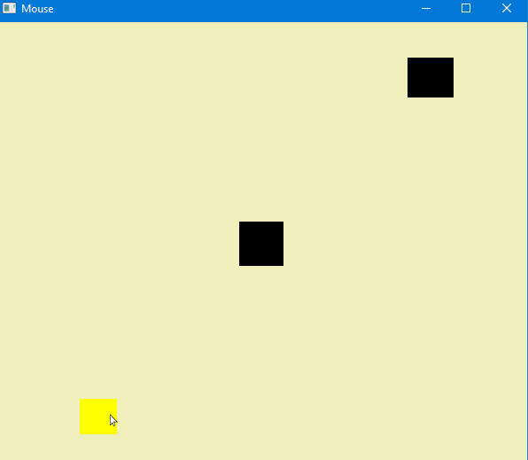

# OpenglMousClickOnPrimitivetoChangeColor
Using OpenGL Geometric primitives &amp; Glut (OpenGL Utility Toolkit a independent window system toolkit for writing OpenGL programs)

#### What is it?
OpenGL program that applies or divert color on Geometry Primitive with the left mouse click.

##### Screenshot

